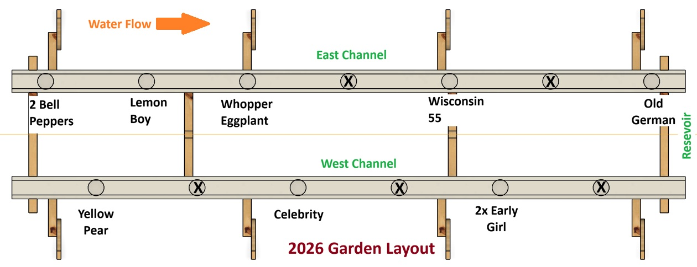

# Season and Layout

**Revision:** 0.2
**Last Updated:** 2026-07-22
**Status:** Draft

---

# Purpose

This document describes how the hydroponic system organizes growing seasons, planting layouts, and crop locations.

The goal is to provide complete traceability from a planting event through harvest while allowing production to be analyzed by season, crop variety, and physical growing location.

---

# Design Goals

The seasonal layout system is intended to:

- Organize production into discrete growing seasons
- Track what crop is planted in each position
- Record planting dates
- Track crop varieties
- Support crop rotation planning
- Associate harvests and waste with the original planting
- Provide long-term production history

---

# Seasonal Organization

A growing season groups all planting, harvest, waste, maintenance, and
production records associated with a single cultivation cycle.

Each season represents a logical production period rather than being limited to
calendar seasons.

Examples include:

- 2026 Outdoor Garden
- 2026 Indoor Lettuce
- Winter 2027 Greens

Each season records:

- Season name
- Growing location
- Start date
- End date
- Current status
- General notes

A season progresses through the following lifecycle:

- Planned
- Active
- Completed

Planting assignments, harvest records, and waste records reference the active
season through their associated planting records, allowing complete production
history to be maintained after a season has ended.

The database design supports multiple seasons over time and allows future
expansion to additional hydroponic systems or growing locations.

---

# Growing Layout

The outside hydroponic system consists of two parallel NFT growing channels.

The channels are identified as:

- East Channel
- West Channel

Water flows through each channel from the water inlet at Position 1 toward the water outlet at the highest numbered position.

Growing positions are permanent physical locations identified by a position code.

Examples:

- E1
- E2
- ...
- E7

- W1
- W2
- ...
- W6

These position identifiers never change between seasons.

Individual seasons assign crop varieties to these permanent locations through
the `hydro_season_planting` table.

## 2026 Garden Layout

The following diagram documents the planting arrangement used during the 2026
outdoor growing season.

It identifies:

- Permanent growing positions
- Water flow direction
- Crop assignments
- Empty positions
- Multiple plants occupying a single planting position

---

# Planting Workflow

Beginning a new growing season consists of:

1. Create or activate the growing season.
2. Select a crop variety.
3. Assign the variety to an available growing position.
4. Specify the number of plants occupying the position.
5. Record the planting date.
6. Save the planting assignment.

After planting assignments are complete, harvest and waste workflows reference
the planting rather than requiring the operator to repeatedly select crop and
variety information.

---

# Crop Variety Management

Crop varieties are maintained independently from seasonal planting records.

A crop variety represents a specific cultivar that may be planted repeatedly
across multiple growing seasons.

Examples include:

- Bell Pepper
- Lemon Boy Tomato
- Early Girl Tomato
- Celebrity Tomato
- Wisconsin 55 Tomato
- Old German Tomato
- Yellow Pear Tomato
- Whopper Eggplant

Each variety is stored once in the `crop_variety` table and may be referenced by
many planting records over multiple seasons.

Separating crop varieties from seasonal plantings allows the system to:

- Compare production between growing seasons
- Evaluate variety performance over time
- Analyze yield by variety
- Support crop rotation planning
- Avoid duplicate variety definitions

The `crop_variety` table identifies the crop type (such as tomato, pepper, or
eggplant) together with the specific variety name and optional seed source.

Seasonal planting assignments reference the variety rather than duplicating crop
information for every planting.
---

# Position Tracking

Growing positions are permanent physical locations within the hydroponic system.

At any point in time, a position is associated with a single active planting.

A planting records:

- Season
- Position
- Crop variety
- Plant count
- Planting date
- Current status

Harvests and waste events are recorded against the planting assignment rather
than directly against the physical position.

This preserves complete production history while allowing the same position to
be reused in future seasons.

---

# Dashboard Integration

Home Assistant provides the operator interface for managing seasons and planting
assignments.

Planned dashboard functions include:

- Viewing the active growing season
- Reviewing the current planting layout
- Selecting a growing position
- Creating or updating planting assignments
- Looking up the crop variety assigned to a position
- Launching harvest and waste recording workflows

The dashboard should present planting positions using the permanent position
codes defined in `hydro_position`.

Crop, variety, plant count, and planting status are resolved from the active
`hydro_season_planting` record rather than duplicated in dashboard configuration.

Detailed dashboard layout, card behavior, popup forms, and history integration
are documented in:

- [04 – Dashboard & History Design](04-dashboard-history-design.md)
---

# Database Design

Season and layout data is stored in the following database tables:

- `hydro_season`
- `hydro_position`
- `crop_variety`
- `hydro_season_planting`

The tables separate permanent physical positions from season-specific crop
assignments.

`hydro_position` defines the fixed East and West channel locations.

`crop_variety` defines the available crop and variety records.

`hydro_season` defines each growing season.

`hydro_season_planting` assigns a crop variety to a physical position for a
specific season and records planting status, plant count, planting date, and
removal date.

Harvest and waste workflows reference the resulting planting assignment rather
than independently storing position, crop, and variety selections.

Detailed schemas, relationships, indexes, and business rules are documented in:

- [01 – Database Design](01-database-design.md)

---

# Future Enhancements

Potential future capabilities include:

- Visual planting maps
- QR code plant identification
- Growth stage tracking
- Variety performance comparisons
- Yield by position
- Crop rotation recommendations

---

# Navigation

**Previous**

- [01 – Database Design](01-database-design.md)

**Next**

- [03 – Harvest & Waste Tracking](03-harvest-and-waste-tracking.md)

**Related Documentation**

- [00 – System Overview](00-system-overview.md)
- [04 – Dashboard & History Design](04-dashboard-history-design.md)

---

# Revision History

| Date | Revision | Description |
|------|----------|-------------|
| 2026-07-22 | 0.2 | Completed seasonal organization, growing layout, planting workflow, crop variety management, position tracking, dashboard integration, and database design sections. Added 2026 garden layout documentation. |
| 2026-07-01 | 0.1 | Initial document outline. |